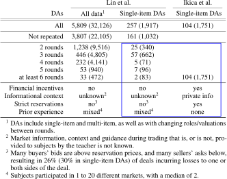
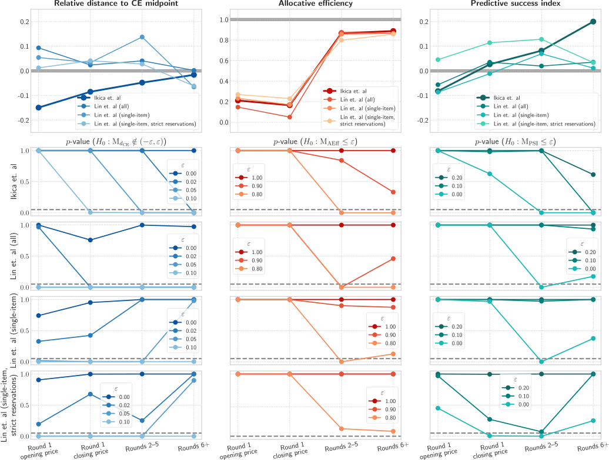

# Experimental double auctions

## Ikica et al. versus Lin et al.

**Data comparison of Ikica et al. [[1]](#1) and Lin et al. [[2]](#2).** The numbers in brackets indicate the number of subjects who participated in the corresponding experimental markets. The blue box highlights the data on repeated single-item bid/ask double auctions à la Vernon [[3]](#3) covered by both.

  

**Overall convergence patterns over time (first-round opening and closing price, round 2–5 prices, round 6+ prices).** The reported values are obtained by taking into account all prices realized in the relevant experimental sessions. _Left._ Mean difference between the price and the midpoint of the corresponding CE range divided by the midpoint. _Middle._ Mean realized allocative efficiency. _Right._ Mean predictive success index. _Rows 2–4._ Hypothesis tests (Wilcoxon signed-rank tests with the Pratt correction). The horizontal dashed line indicates the 0.05 significance level.

  

## References
<a id="1">[1]</a> 
B. Ikica, S. Jantschgi, H. H. Nax, D. G. Nuñez‐Duran, B. S. R. Pradelski, _Competitive Market Behavior: Convergence and Asymmetry in the Experimental Double Auction_. _Submitted, available [here](http://dx.doi.org/10.2139/ssrn.3131004). See also the accompanying [GitHub repository](https://github.com/ikicab/Trading-in-a-Black-Box) and [OSF](https://osf.io/gu62n/)._\
<a id="2">[2]</a>
P.-H. Lin, A. L. Brown, T. Imai, J. T.-y. Wang, S. W. Wang & C. F. Camerer, _Evidence of general economic principles of bargaining and trade from 2,000 classroom experiments_, Nat. Hum. Behav. 4 (2020), 917–927. _Available [here](https://doi.org/10.1038/s41562-020-0916-8). Raw data can be found at the corresponding [OSF repository](https://osf.io/9mfws/)._\
<a id="3">[3]</a>
V. Smith, _An Experimental Study of Competitive Market Behavior_, J. Political Econ. 70(2) (1962), 111–137. _Available [here](http://www.jstor.org/stable/1861810)._

